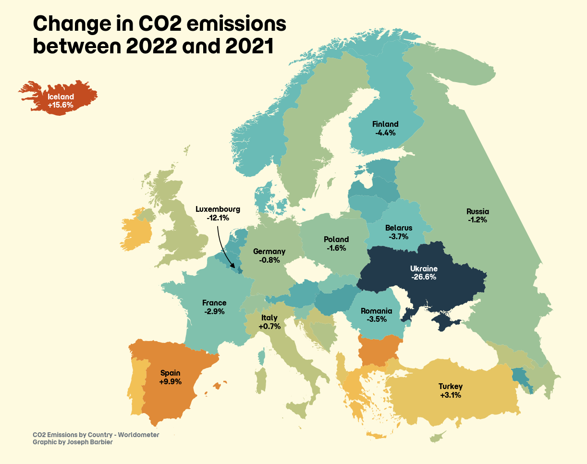
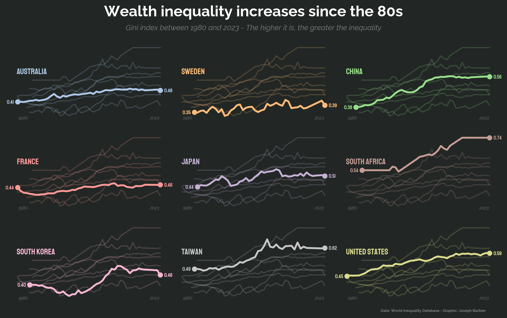

# Data visualizations of all kinds

<br>

## Table of content

- [CO2 emissions in Europe](#co2-emissions-in-europe)
- [Inequality since the 80s](#inequality-since-the-80s)

<br>

## Installation

```bash
git clone https://github.com/JosephBARBIERDARNAL/dataviz.git
cd dataviz
uv sync
```

Reproduce a chart:

```bash
uv run src/co2-by-country-europe
```

<br><br><br>

### CO2 emissions in Europe



[Code](src/co2-by-country-europe/__main__.py)

<br>

### Inequality since the 80s



[Code](src/inequality-since-1980/__main__.py)
